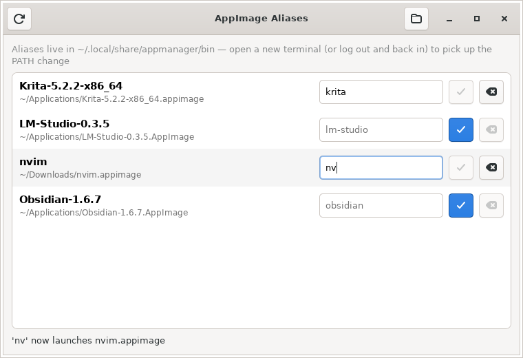

# appmanager

A small GTK4 GUI written in Nim ([owlkettle](https://github.com/can-lehmann/owlkettle))
that finds the AppImages you have installed, lets you give each one a short
command-line alias, and puts those aliases on your `PATH`. It can also search
AppImageHub and GitHub for new AppImages, install them, keep them updated and
add them to your application menu, much like
[Gear Lever](https://github.com/mijorus/gearlever).



## Features

- Scans `~/Applications`, `~/AppImages`, `~/.local/bin`, `~/bin`, `~/Downloads`
  and `/opt` (up to two levels deep) for AppImages. Files are recognised by a
  `.AppImage` extension or by the AppImage ELF magic, so renamed AppImages are
  found too. Use the folder button in the header bar to add or remove folders.
- Suggests an alias from the file name (`Krita-5.2.2-x86_64.appimage` → `krita`).
  To accept it, press the ✓ button or Enter. You can also type your own.
- For each alias it writes a small launcher script to
  `~/.local/share/appmanager/bin/<alias>`:

  ```sh
  #!/bin/sh
  # managed-by: appmanager
  exec '/home/you/Applications/Krita-5.2.2-x86_64.appimage' "$@"
  ```

  It also marks the AppImage executable if it isn't already.
- Adds that folder to `PATH` by writing a marked block to `~/.profile`, to
  `~/.bashrc` and `~/.zshrc` if they exist, and to
  `~/.config/fish/conf.d/appmanager.fish` if you use fish. Open a new terminal
  afterwards to use the aliases.
- Warns if an alias would shadow an existing command. It refuses duplicate
  aliases and never overwrites or deletes files it didn't create.

### Finding and installing AppImages

The **Browse** tab searches three sources:

- **AppImageHub**: the [appimage.github.io](https://appimage.github.io) catalog
  of about 1,300 apps published on GitHub.
- **pkgforge-dev**: the roughly 450
  [Anylinux AppImages](https://github.com/pkgforge-dev/Anylinux-AppImages)
  that pkgforge-dev builds, plus the projects it lists as shipping their own.
  They bundle every library they need, so they also run on old, musl-based
  and non-FHS distributions, and they don't need FUSE.
- **GitHub**: repositories whose name, description, topics or README mention
  AppImage, most-starred first. Press Enter to search.

AppImageHub and pkgforge-dev are downloaded at most once a day to
`~/.cache/appmanager/` and filtered as you type.

**Install** downloads the newest release asset that is an AppImage for your
CPU (stable releases are preferred over pre-releases) into `~/Applications`
and makes it executable. It also adds the app to your application menu and,
if the suggested alias is free, gives it that alias.

### Updates

**Check for updates** checks every AppImage. The ⋯ menu on a row checks just
that one. appmanager finds updates in one of these places:

1. an update source you set in the ⋯ menu: a GitHub repository (`owner/repo`
   or its URL) or a `.zsync` URL. Apps installed from **Browse** get their
   repository set automatically.
2. the update information embedded in the AppImage (its `.upd_info` section),
   in the `gh-releases-zsync|…` or `zsync|…` format that AppImageUpdate uses.

When the release has a `.zsync` file, appmanager compares that file's SHA-1
with the installed AppImage. Otherwise it compares the release asset with the
one it installed. **Update** downloads the new build next to the old one,
checks its SHA-1 when it can, and then replaces the old file. The path
doesn't change, so aliases and menu entries keep working.

### Keeping AppImages in one place

If any AppImages live outside `~/Applications` (in `~/Downloads`, say), a
banner offers to move them there. Each AppImage's ⋯ menu also has a
**Move to ~/Applications** item. The alias, update source and menu entry
follow the file to its new path. Nothing is overwritten: if a file with
the same name is already there, that AppImage stays where it is.
Symlinks are left alone. **Don't ask again** hides the banner for good.

### App menu and removal

In the ⋯ menu, **Add to app menu** extracts the AppImage's `.desktop` file
and icon with `--appimage-extract`. It writes the entry to
`~/.local/share/applications/appmanager-*.desktop`, with `Exec=` pointing at
the AppImage. The icon goes into the hicolor icon theme,
`~/.local/share/icons/hicolor/<size>/apps/` (`scalable` for SVGs), under the
same name as the entry, so `Icon=` can use that name. If you already have an
icon cache there, it is rebuilt. Entries made by an older appmanager are
rebuilt on startup (for example, ones that missed an AppImage's own
`.desktop` file); entries you removed stay removed.
**Delete…** removes the AppImage, its alias and its menu entry.

### Opening AppImages from the file manager

To have double-clicking an AppImage open appmanager instead of another app
(such as Gear Lever), open the ☰ menu and press **Open AppImages with
AppManager**. This writes `~/.local/share/applications/dev.appmanager.AppManager.desktop`
(pointing at the running binary, or at the AppImage appmanager runs from)
and makes it the default for `application/vnd.appimage` and
`application/x-iso9660-appimage` in `~/.config/mimeapps.list`, and in any
desktop-specific list such as `~/.config/gnome-mimeapps.list` that already
exists. You can also run `appmanager some.AppImage`.

An opened AppImage appears at the top of the **Installed** tab with two
choices: **Run** starts it, and **Install** moves it to `~/Applications`,
adds it to your application menu and gives it an alias. If appmanager is
already running, the file opens in that window.

Downloads use `curl`, and hashes use `sha1sum` from your system. GitHub
allows 60 unauthenticated API requests an hour. If you check many apps,
export `GITHUB_TOKEN` to raise that limit. appmanager passes the token to
curl in a private config file, not on the command line.

Aliases, scan folders and update sources are stored in
`~/.config/appmanager/config.json`.

## Building

You need Nim ≥ 2.0 and the GTK 4 development files (`libgtk-4-dev` on
Debian/Ubuntu, `gtk4-devel` on Fedora, `gtk4` on Arch).

```sh
nimble build      # produces ./appmanager
nimble test       # runs the core and store tests (no GTK or network needed)
./appmanager
```

## AppImage

Every push to `main` builds `appmanager-<version>-x86_64.AppImage` in CI
([`.github/workflows/appimage.yml`](.github/workflows/appimage.yml)) and
publishes it, with a matching `.zsync` file, to the single rolling GitHub
release tagged [`release`](https://github.com/codegod100/appmanager/releases/tag/release).
Each build replaces the previous one; there are no versioned releases.

The AppImage embeds this update information:

```
gh-releases-zsync|codegod100|appmanager|release|appmanager-*-x86_64.AppImage.zsync
```

This lets [AppImageUpdate](https://github.com/AppImageCommunity/AppImageUpdate),
Gear Lever, AppImageLauncher and similar tools update it in place. They only
download the blocks that changed.

To build one locally (needs `zsync` for the `.zsync` file):

```sh
packaging/build-appimage.sh          # -> dist/appmanager-<version>-x86_64.AppImage
```

The icon source is [`data/icons/hicolor/scalable/apps/dev.appmanager.AppManager.svg`](data/icons/hicolor/scalable/apps/dev.appmanager.AppManager.svg).
